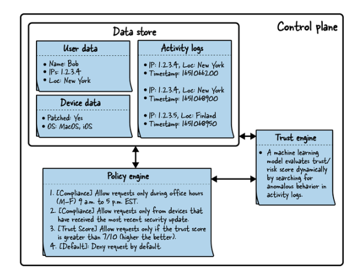

#### Making Authorization Decisions

The zero-trust architecture comprises 4 main components 

- Enforcement
- Policy Engine
- Trust Engine
- Data stores

### Control Plane vs. Data Plane

In a Zero Trust architecture, the **Control Plane** (the "brain") makes security decisions based on policies and inputs from trust engines, while the **Data Plane** (the "muscle") enforces those decisions on live traffic.

```mermaid
graph TD
    subgraph Control_Plane [Control Plane: The "Brain"]
        PolicyEngine[Policy Decision Point / Controller]
        TrustEngine[Trust Engine]
        DataStore[(Data Stores)]
    end

    subgraph Data_Plane [Data Plane: The "Muscle"]
        Traffic[Incoming Traffic]
        Enforcer[Policy Enforcement Point / Proxy / Gateway]
    end

    PolicyEngine -- "Pushes Policies & Configuration" --> Enforcer
    TrustEngine -- "Provides Context" --> PolicyEngine
    PolicyEngine -- "Queries/Updates" --> DataStore
    Traffic -- "Traffic to be Checked" --> Enforcer
    Enforcer -- "Allow/Deny/Route" --> TrafficOut[Destination]
```



| Feature | Control Plane | Data Plane |
| :--- | :--- | :--- |
| **Primary Goal** | Decision making, configuration | Traffic handling, enforcement |
| **Action** | Analyzes identities, health, policies | Forwards, drops, or modifies packets |
| **Speed/Volume** | Slower, low-volume (control messages) | High-speed, high-volume (data traffic) |
| **Analogy** | The Security Guard (making decisions) | The Door/Lock (enforcing access) |

Control plane: Policy engine talk with Data Store, trust Engine talk with Policy Engine and
do something in Data STores

Data Plane: Enforcement, which talk with policy engine

