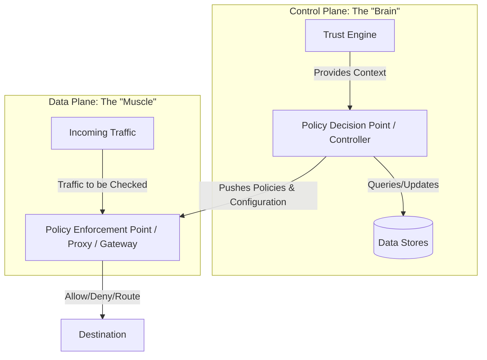

#### Making Authorization Decisions

The zero-trust architecture comprises 4 main components 

- Enforcement
- Policy Engine
- Trust Engine
- Data stores

**Component definitions:**

- **Enforcement (Policy Enforcement Point, PEP)**: sits in the data path. It intercepts the request, asks the policy engine for a decision, and then allows, denies, or routes the traffic. It does not decide policy itself — it executes decisions.
- **Policy Engine (Policy Decision Point, PDP)**: compares the request against configured policy and returns allow/deny. It consults the trust engine for context and reads/writes the data stores. This is where least-privilege policy actually lives.
- **Trust Engine**: computes the **trust score** for the actors in a request using signals from the data stores (behavior history, device posture, threat intelligence). It provides context to the policy engine but does not make the final decision. This is the component that realizes the continuous trust score from earlier chapters.
- **Data stores**: the source-of-truth inventories the system reasons over — users, devices, and their observed activity. They feed the trust engine and are queried/updated by the policy engine.

```
        Decision Flow Between the Four Components
        -----------------------------------------

   Request --> [ Enforcement / PEP ]
                     |  asks "may this proceed?"
                     v
              [ Policy Engine / PDP ] --context--> [ Trust Engine ]
                     |                                   |
                     | query/update                      | reads signals
                     v                                   v
              [ Data Stores ] <-------------------------- +
                     |
   Decision (allow/deny) returned to Enforcement, which acts on the traffic
```

### Control Plane vs. Data Plane

In a Zero Trust architecture, the **Control Plane** (the "brain") makes security decisions based on policies and inputs from trust engines, while the **Data Plane** (the "muscle") enforces those decisions on live traffic.




| Feature | Control Plane | Data Plane |
| :--- | :--- | :--- |
| **Primary Goal** | Decision making, configuration | Traffic handling, enforcement |
| **Action** | Analyzes identities, health, policies | Forwards, drops, or modifies packets |
| **Speed/Volume** | Slower, low-volume (control messages) | High-speed, high-volume (data traffic) |
| **Analogy** | The Security Guard (making decisions) | The Door/Lock (enforcing access) |

**How the components split across the planes:**

- **Control plane**: the Policy Engine, Trust Engine, and Data Stores. The Policy Engine reads and updates the Data Stores; the Trust Engine feeds context (the trust score) into the Policy Engine and derives its signals from the Data Stores.
- **Data plane**: Enforcement (the PEP). It carries live traffic and calls the Policy Engine for every decision, then allows, denies, or routes accordingly.

Keeping decisions in a low-volume control plane and enforcement in a high-volume data plane is what lets Zero Trust evaluate every request without the policy logic becoming a bottleneck.

### Relation to Kubernetes (k8s)

The four-component model maps almost one-to-one onto how the Kubernetes API server admits a request:

```
        Kubernetes as a Zero Trust PDP/PEP
        ----------------------------------

   kubectl / client request
        |
        v
   [ API server = Enforcement / PEP ]
        |
        +--> AuthN (cert / OIDC / token)
        |
        +--> [ Authorizer = Policy Engine / PDP ]  RBAC / Webhook / OPA Gatekeeper
        |
        +--> [ Admission webhooks ] validate / mutate  (extended policy engine)
        |
        v
   persist to [ etcd = Data Store ]
```

- **Enforcement / PEP** = the **API server** (and, for pod-to-pod traffic, the service-mesh sidecar / Envoy proxy). It is in the request path and executes the decision.
- **Policy Engine / PDP** = the **authorizer** — RBAC, ABAC, or a **Webhook authorizer**; **OPA/Gatekeeper** and validating admission webhooks act as an external policy engine.
- **Trust Engine** = there is no built-in trust-score engine in vanilla k8s; this role is filled by add-ons that feed context — device/workload posture (SPIFFE/SPIRE), image-signing verification, or risk signals consumed by admission webhooks.
- **Data Stores** = **etcd** (cluster state) plus the identity/inventory sources (service accounts, OIDC provider, node inventory).
- **Control plane vs data plane** is literally k8s terminology: the control plane (API server, controllers, etcd) makes decisions; the data plane (kubelets, proxies, mesh sidecars) enforces them on live traffic.

The takeaway: an admission webhook or OPA policy is a concrete, runnable Policy Engine, and etcd is the Data Store — Kubernetes is a working example of this chapter's architecture.
